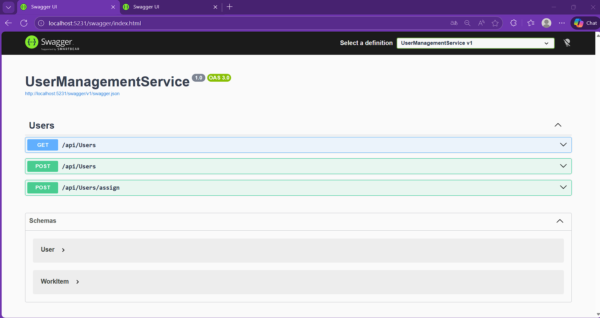
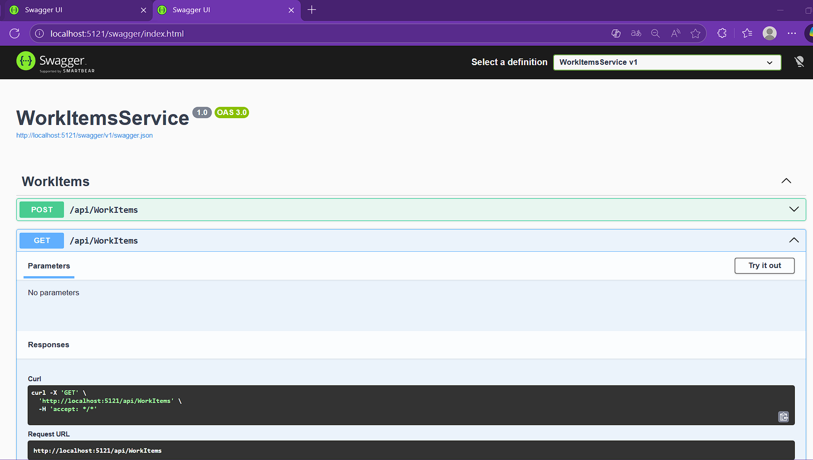
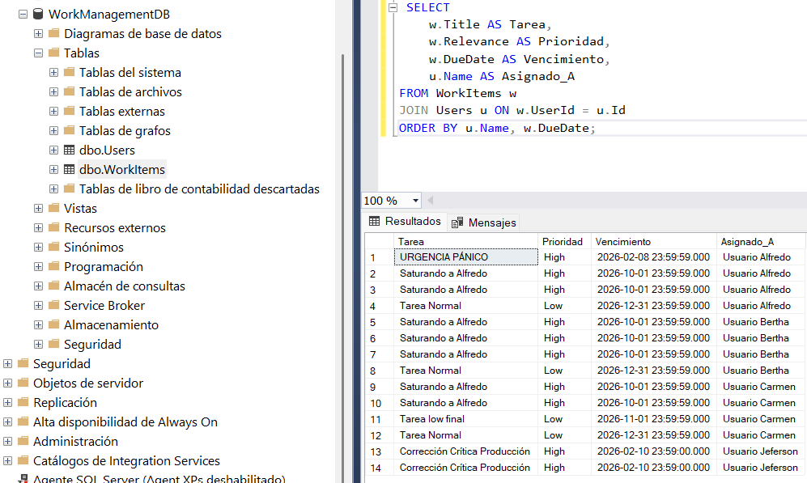

# Sistema de Gestión de Ítems de Trabajo (Microservicios)

Este proyecto implementa una solución de backend distribuida utilizando **.NET 10** y **SQL Server**. El sistema ha sido desarrollado para cumplir con principios de **Arquitectura Limpia**, **Inyección de Dependencias** y separación de responsabilidades, garantizando una asignación de tareas eficiente y escalable.

## 🚀 Arquitectura y Diseño

El sistema sigue un patrón de microservicios con comunicación síncrona HTTP. La lógica de negocio ha sido centralizada en el dominio de usuarios para asegurar la integridad de los datos de carga laboral.

### Microservicios:
1.  **UserManagementService (Core):**
    * Actúa como la "fuente de la verdad" sobre la carga de los usuarios.
    * Expone el endpoint inteligente `POST /api/users/assign`.
    * **Lógica Implementada:** Contiene el algoritmo de decisión (Saturación, Prioridad y Urgencia).
    
2.  **WorkItemsService (Orquestador):**
    * Gestiona el ciclo de vida de las tareas.
    * Actúa como cliente del servicio de usuarios, delegando la decisión de asignación para mantener el desacoplamiento.

### 🧠 Lógica de Negocio (Algoritmo de Asignación)
El sistema implementa estrictamente las siguientes reglas de negocio:

1.  **Manejo de Urgencias:** Si una tarea vence en **menos de 3 días**, el sistema ignora cualquier otra regla y la asigna al usuario con menor carga absoluta (Modo Pánico).
2.  **Control de Saturación:** Un usuario se considera "saturado" si tiene **3 o más tareas de Alta Relevancia ('High')**. El algoritmo evita asignar nuevas tareas críticas a usuarios saturados.
3.  **Balanceo de Carga:** En condiciones normales, las tareas se distribuyen equitativamente buscando siempre al usuario con menos pendientes.

## 📋 Requisitos Previos

* [.NET 10 SDK] (Versión compatible con el proyecto)
* [SQL Server] (Local o Docker)
* Editor de codigo (Visual Studio Code)

## ⚙️ Configuración e Instalación

### 1. Base de Datos
Ejecute el script `script_db.sql` ubicado en la carpeta `DataBase` para generar el esquema relacional (`WorkManagementDB`) y poblar los datos semilla.

### 2. Configuración de Entorno
Configure la cadena de conexión en los archivos `appsettings.json` de **ambos** microservicios:

**Rutas:**
* `backend/UserManagementService/appsettings.json`
* `backend/WorkItemsService/appsettings.json`

```json
"ConnectionStrings": {
  "DefaultConnection": "Server=SU_SERVIDOR; Database=WorkManagementDB; User Id=SU_USUARIO; Password=SU_PASSWORD; TrustServerCertificate=True;"
}


```
## 🛠️ Ejecución del Proyecto
Para levantar el ecosistema completo, abra dos terminales:
### TERMINAL 1 : Iniciar Microservicio UserManagementService
Este servicio debe iniciarse primero o estar disponible para que WorkItems pueda comunicarse, ejecute:

```json
cd backend/UserManagementService
dotnet run 
```
#### Swagger UI: Una vez iniciado, acceda a la documentación en: http://localhost:5231/swagger/index.html


### TERMINAL 2 : Iniciar Microservicio WorkItemsService
En la segunda terminal, ejecute:
```json
cd backend/WorkItemsService
dotnet run
```
#### Swagger UI: Una vez iniciado, acceda a la documentación en: http://localhost:5121/swagger/index.html


## ✅ Verificación de Resultados (Casos de Uso)
Puede verificar el cumplimiento de las reglas de negocio utilizando Postman o Swagger en el endpoint:
#### POST /api/WorkItems

#### Caso 1: Prueba de Urgencia (Prioridad Máxima)
**Escenario:** Tarea con fecha de vencimiento próxima (< 3 días). Comportamiento: Debe asignarse al usuario con menos ítems totales, ignorando niveles de senioridad. 
```json
{
  "title": "Corrección Crítica",
  "description": "Vence mañana, ignorar saturación.",
  "relevance": "High",
  "dueDate": "2026-02-10T23:59:59" 
}
```
- Nota: Ajuste la fecha dueDate al día de mañana según su fecha actual.

#### Caso 2: Prueba de Saturación
**Escenario:** Intentar asignar una tarea "High" a un usuario que ya tiene 3 tareas "High".  
**Comportamiento:** El sistema detectará la saturación y buscará al siguiente usuario disponible, aunque el primero tenga menos carga total.  

```json
{
  "title": "Proyecto Grande",
  "description": "Prueba de límite de carga",
  "relevance": "High",
  "dueDate": "2026-12-01T00:00:00"
}
```
## 🔍 Consultas de Verificación SQL
Para auditar las asignaciones realizadas por el algoritmo:
```json
{
 SELECT 
    w.Title AS Tarea, 
    w.Relevance AS Prioridad, 
    w.DueDate AS Vencimiento,
    u.Name AS Asignado_A
FROM WorkItems w
JOIN Users u ON w.UserId = u.Id
ORDER BY u.Name, w.DueDate;
}
```
- Resultado esperado


